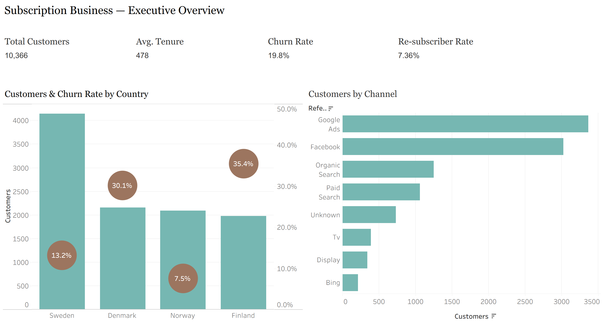
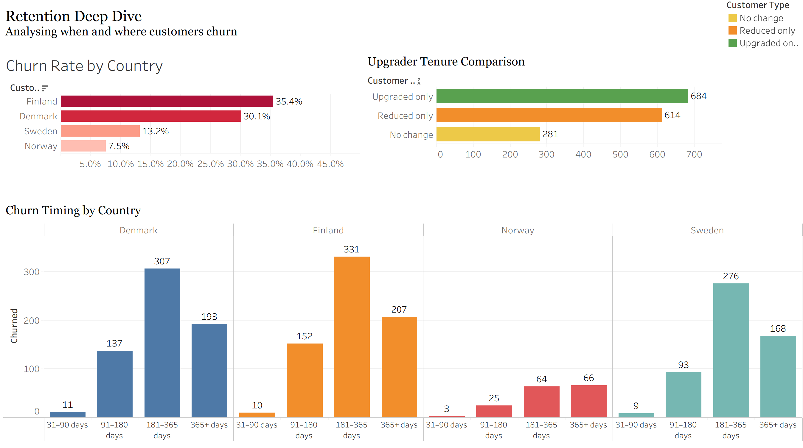

# 📊 Subscription Business Performance Analysis



---

## 📌 Project Overview

This project analyses **18,106 subscription transactions** across 10,366 unique customers spanning January 2020 to December 2022 across four Nordic markets — Sweden, Denmark, Finland, and Norway.

The analysis is framed around real business questions a **Retention Analyst**, **Growth Analyst**, or **Business Insights Analyst** would be asked at a SaaS or subscription business.

**Tools Used:** PostgreSQL · Tableau Public · Python (planned)
**Dataset:** Customer Subscription and Transaction Details — Kaggle
**Role Focus:** Data Analyst · Business Analyst · Growth Analytics

🔗 **[View Live Tableau Dashboard](https://public.tableau.com/app/profile/gayatri.triplicane/viz/SubscriptionBusinessPerformanceAnalysis/Overview-SubscriptionAnalysis)**

---

## 🎯 Business Questions Answered

| # | Business Question | Stakeholder | Analysis |
|---|------------------|-------------|----------|
| 1 | Which acquisition channel retains customers best? | Marketing Head | Channel Retention |
| 2 | When does churn spike in the customer lifecycle? | Product Manager | Churn Timing |
| 3 | Which country has the healthiest revenue trajectory? | Country Manager | Revenue Analysis |
| 4 | Do upgraders stay longer than non-upgraders? | Finance / CEO | Upgrader Tenure |
| 5 | Are newer cohorts healthier than older ones? | Investor | Cohort Retention |

---

## 📁 Project Structure

```
subscription-analytics-portfolio/
│
├── sql/
│   ├── 01_staging.sql                  # Raw CSV load into staging layer
│   ├── 02_cleaning.sql                 # Cleaned analytics layer + dedup logic
│   └── 03_views.sql                    # 7 analytics views for Tableau
│
├── dashboard/
│   ├── page1_executive_overview.png    # Executive Overview dashboard
│   └── page2_retention_deep_dive.png   # Retention Deep Dive dashboard
│
└── README.md
```

---

## 🗄️ Data Architecture

This project uses a two-layer architecture:

```
Staging Layer                    Analytics Layer
─────────────────                ─────────────────────────────
staging.subscriptions      →     analytics.subscriptions_clean
Raw CSV loaded as-is             Cleaned + deduplicated
                                 Ready for analysis + Tableau
```

**Staging → Analytics transformations:**
- `transaction_type` uppercased for consistency
- `transaction_date` cast from text to DATE
- `referral_type` standardised with INITCAP
- **104 duplicate churn rows removed:**
  - 97 identified as data entry errors
  - 7 re-subscribers handled using MIN churn date per customer

---

## 🗃️ Dataset Schema

### `subscriptions_clean` (18,106 transactions → 10,366 unique customers)

| Column | Type | Description |
|--------|------|-------------|
| cust_id | VARCHAR | Unique customer identifier |
| transaction_type | TEXT | INITIAL / UPGRADE / REDUCTION / CHURN |
| transaction_date | DATE | Date of transaction |
| subscription_type | TEXT | BASIC / PRO / MAX |
| subscription_price | NUMERIC | Monthly subscription price |
| customer_gender | TEXT | Customer gender |
| age_group | TEXT | Customer age bracket |
| customer_country | TEXT | Sweden / Denmark / Finland / Norway |
| referral_type | TEXT | 8 acquisition channels |

**Date Range:** January 2020 — December 2022
**Markets:** Sweden · Denmark · Finland · Norway

---

## 🔑 SQL Skills Demonstrated

| Skill | Where Used |
|-------|------------|
| Staging layer creation | `01_staging.sql` |
| Data type casting | `02_cleaning.sql` |
| Deduplication logic | `02_cleaning.sql` |
| DISTINCT ON for re-subscriber handling | `02_cleaning.sql` |
| CTEs (WITH clauses) | `03_views.sql` |
| Window functions — ROW_NUMBER, LAG | `03_views.sql` |
| DATE arithmetic for tenure calculation | `03_views.sql` |
| Cohort analysis logic | `03_views.sql` |
| CASE WHEN bucketing | `03_views.sql` |
| Aggregations — COUNT, AVG, SUM | All files |
| CREATE VIEW for BI tooling | `03_views.sql` |

---

## 📊 Analytics Views

| View | Purpose | Powers |
|------|---------|--------|
| `customer_summary` | One row per customer with tenure, tier, churn flag | Base for all analysis |
| `channel_retention` | Churn rate and upgrade rate by acquisition channel | Marketing analysis |
| `churn_timing_by_country` | Days-to-churn buckets by country | Product analysis |
| `net_revenue_by_country` | MRR trend by country over time | Revenue analysis |
| `tier_transitions` | Movement between BASIC/PRO/MAX tiers | Upgrade analysis |
| `upgrader_tenure` | Avg days retained — upgraders vs non-upgraders | Finance analysis |
| `cohort_retention` | Monthly cohort survival rates | Investor analysis |

---

## 📊 Tableau Dashboards

🔗 **[View Full Interactive Dashboard on Tableau Public](https://public.tableau.com/app/profile/gayatri.triplicane/viz/SubscriptionBusinessPerformanceAnalysis/Overview-SubscriptionAnalysis)**

---

### Page 1 — Executive Overview


**What it shows:**
- KPI tiles: total customers, avg tenure, churn rate, MRR
- Customers by country with churn rate overlay dots
- Customers by acquisition channel

**Key Insights:**
- Sweden leads with the lowest churn rate at **13.2%** — strongest market overall
- Norway has only **7.5% churn** — smallest market but highest quality customer base
- Denmark (**30.1%**) and Finland (**35.4%**) represent significant retention risk requiring targeted intervention

---

### Page 2 — Retention Deep Dive



**What it shows:**
- Churn rate by country comparison
- Upgrader vs non-upgrader tenure comparison
- Churn timing buckets by country

**Key Insights:**
- **Zero churn in first 30 days** across all markets — onboarding is not the problem
- Danger zone is **91–365 days** — this is a long-term value problem, not an activation problem
- Upgraders retain **2.4x longer** — 684 days vs 281 days for non-upgraders
- **Organic Search** delivers best retention (17.1% churn, 32.1% upgrade rate) despite lowest acquisition volume
- TV and Bing show worst retention — high volume, low quality acquisition

---

## 💡 Key Business Findings

### 1. Channel Quality Beats Channel Volume
```
Organic Search  → 17.1% churn | 32.1% upgrade rate ← best quality
TV              → high volume  | worst retention    ← costly mistake
Bing            → high volume  | worst retention    ← costly mistake
```
**Recommendation:** Shift marketing budget from TV/Bing toward Organic Search investment (SEO, content).

---

### 2. The 91–365 Day Danger Zone
```
0–30 days    → 0% churn    (onboarding working)
31–90 days   → low churn   (honeymoon period)
91–365 days  → churn spikes (value gap emerging)
365+ days    → stabilises  (loyal customer segment)
```
**Recommendation:** Launch targeted re-engagement campaigns at day 60 and day 90 before churn spike hits.

---

### 3. Upgrades Are The Strongest Retention Signal
```
Upgraders      → 684 avg days retained
Non-upgraders  → 281 avg days retained
Difference     → 2.4x longer retention
```
**Recommendation:** Prioritise upgrade prompts at day 30–60 when customers are engaged but not yet at risk.

---

### 4. Market-Level Revenue Health
```
Sweden   → MRR growing 6K → 10K  ← invest and scale
Norway   → volatile MRR despite low churn ← pricing opportunity
Denmark  → MRR flat  ← needs intervention
Finland  → worst churn + flat MRR ← consider market exit or reset
```

---

### 5. Cohort Health
```
Newer cohorts show improving retention vs 2020 cohorts
Suggests product improvements and better channel mix
are beginning to have measurable impact
```

---

## 🚀 How To Run

### 1. Download Dataset
Download from Kaggle and place CSV in a `/data` folder.

### 2. PostgreSQL Setup
```bash
# Run in order
psql -U your_user -d your_database -f sql/01_staging.sql
psql -U your_user -d your_database -f sql/02_cleaning.sql
psql -U your_user -d your_database -f sql/03_views.sql
```

### 3. Tableau Public
Connect via PostgreSQL connector and use these views:
```
Page 1 → analytics.customer_summary
         analytics.net_revenue_by_country
         analytics.channel_retention

Page 2 → analytics.churn_timing_by_country
         analytics.upgrader_tenure
         analytics.channel_retention
```

---

## 🐍 Python Analysis (Planned)

```
⬜ Kaplan-Meier survival curves by country and channel
⬜ Cox proportional hazards model for churn prediction
⬜ Customer lifetime value (CLV) modelling
⬜ Cohort heatmap visualisation
```

---

## 👤 Author

**Triplicane Gayatri**
https://www.linkedin.com/in/gayatri-triplicane/ · https://github.com/nidhi0908

---

*This project was built as part of a self-directed data analytics portfolio focusing on SQL, Tableau, and Python.*
